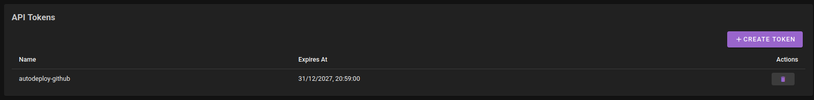
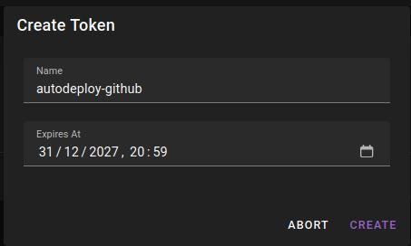
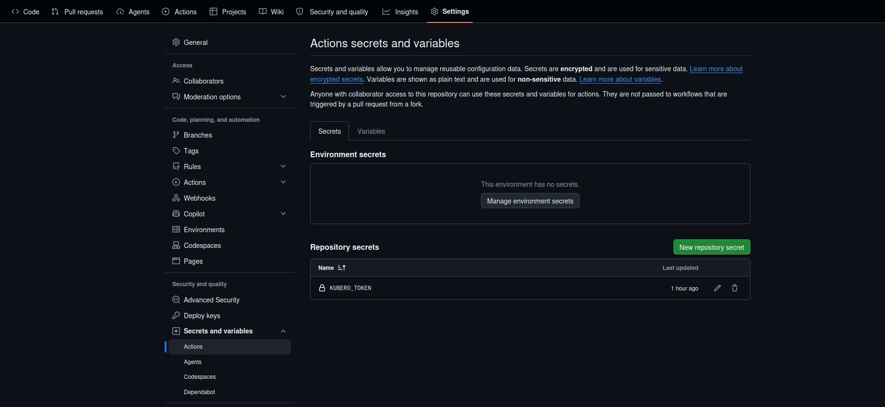
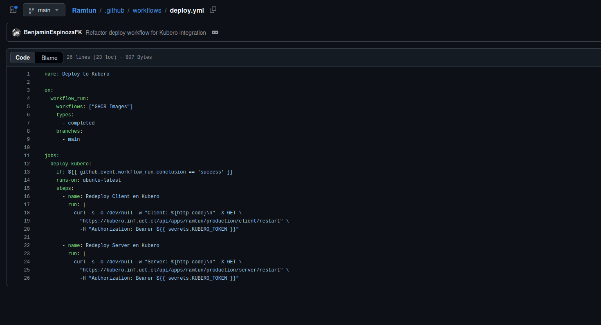
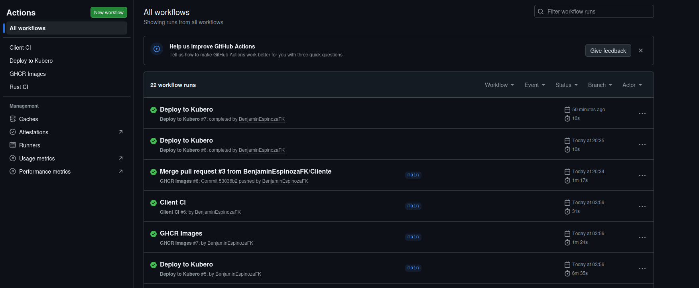
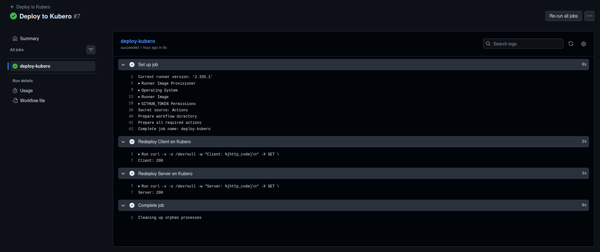

# Autodeploy: Redespliegue Automático

El **autodeploy** permite que cada vez que un estudiante hace `git push` a su repositorio, Kubero redespliega la aplicación automáticamente con la nueva imagen — sin que nadie tenga que hacer nada manualmente.

El flujo completo es:

```
git push → GitHub Actions (construye imagen) → llama API de Kubero → Kubero redespliegue ✓
```

---

## ¿Qué hace el profesor? (una sola vez por curso)

El profesor genera un **token de autorización** para el API de Kubero y lo comparte con los estudiantes. Este token le permite a GitHub Actions autorizarse ante Kubero para solicitar el redepliegue.

1. Accede a `https://kubero.inf.uct.cl` con tu usuario
2. Haz clic en tu avatar (esquina superior derecha) → **"Profile"**
3. En la sección **"API Tokens"**, haz clic en **"+ CREATE TOKEN"**
4. Completa los campos:

   | Campo | Valor |
   |---|---|
   | **Name** | `autodeploy-github` |
   | **Expires At** | Una fecha lejana, ej: `31/12/2027` — debes completar también la hora, ej: `23:59` |

5. Haz clic en **"CREATE"**
6. **Copia el token inmediatamente.** Solo se muestra una vez y no se puede recuperar después.
7. Comparte este token con tus estudiantes. Puede ser el mismo token para todos.





> Tras hacer clic en **CREATE**, aparecerá una ventana con el token generado y un botón **COPY TOKEN**. Cópialo inmediatamente — solo se muestra una vez y no puede recuperarse. Por seguridad no se incluye captura de esta pantalla.

> Si el token vence o se pierde, el profesor debe generar uno nuevo y cada estudiante deberá actualizar el secret `KUBERO_TOKEN` en su repositorio de GitHub.

---

## ¿Qué hace el estudiante? (una sola vez por proyecto)

Con el token que entregó el profesor, el estudiante lo registra en su repositorio de GitHub y agrega un archivo que activa el redepliegue automático.

### Paso 1 — Agregar el token como secret en GitHub

1. Ve a tu repositorio en GitHub
2. Haz clic en **"Settings"** → **"Secrets and variables"** → **"Actions"**
3. Haz clic en **"New repository secret"**
4. Completa:

   | Campo | Valor |
   |---|---|
   | **Name** | `KUBERO_TOKEN` |
   | **Secret** | Pega el token que te entregó el profesor |

5. Haz clic en **"Add secret"**



> Al hacer clic en **"New repository secret"**, aparecerá un formulario con dos campos: **Name** (escribe `KUBERO_TOKEN`) y **Secret** (pega el token que entregó el profesor). Luego haz clic en **"Add secret"** y el secret quedará visible en la lista con el nombre `KUBERO_TOKEN`.

### Paso 2 — Agregar el workflow de redepliegue

En tu repositorio, crea el archivo `.github/workflows/deploy.yml` con el siguiente contenido.

Reemplaza los valores marcados con los de tu proyecto en Kubero:

```yaml
name: Deploy to Kubero

on:
  workflow_run:
    workflows: ["Docker Build"]   # Cambia esto por el nombre exacto de tu workflow de build
    types:
      - completed
    branches:
      - main

jobs:
  deploy-kubero:
    if: ${{ github.event.workflow_run.conclusion == 'success' }}
    runs-on: ubuntu-latest
    steps:
      - name: Redeploy en Kubero
        run: |
          curl -s -o /dev/null -w "%{http_code}\n" -X GET \
            "https://kubero.inf.uct.cl/api/apps/NOMBRE-PIPELINE/production/NOMBRE-APP/restart" \
            -H "Authorization: Bearer ${{ secrets.KUBERO_TOKEN }}"
```

> - `"Docker Build"` → el nombre exacto del workflow que construye tu imagen (revisa la pestaña Actions de tu repo para ver el nombre)
> - `NOMBRE-PIPELINE` → el nombre del pipeline en Kubero (ej: `mi-proyecto`)
> - `NOMBRE-APP` → el nombre de la app dentro del pipeline (ej: `frontend` o `backend`)
> - Si tienes frontend y backend, agrega un paso adicional por cada uno



### Paso 3 — Verificar que funciona

1. Haz cualquier cambio en tu código y haz `git push` a `main`
2. Ve a la pestaña **"Actions"** de tu repositorio en GitHub
3. Primero se ejecuta el workflow de build (construye la imagen)
4. Al terminar, se activa automáticamente el workflow **"Deploy to Kubero"**
5. El paso debe mostrar `200` como resultado — eso confirma que Kubero recibió el redepliegue





| Código de respuesta | Significado |
|---|---|
| `200` | Redepliegue exitoso |
| `401` o `403` | Token incorrecto o vencido — pídele al profesor uno nuevo |
| `404` | El nombre del pipeline o app no coincide con Kubero — verifica los nombres |
