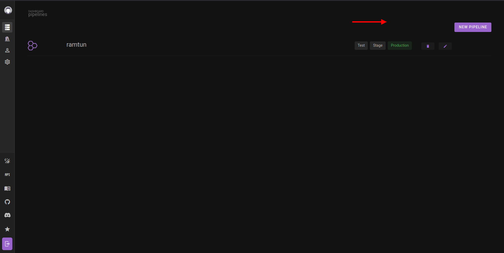
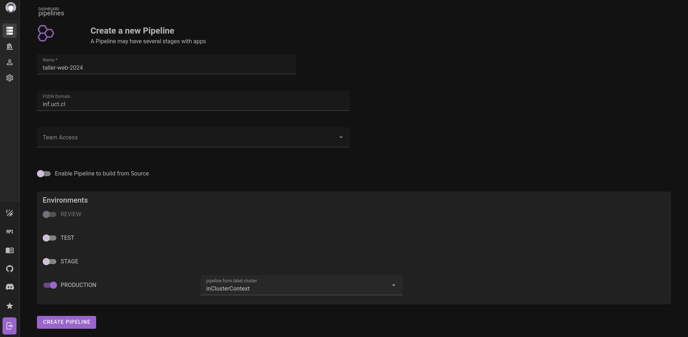
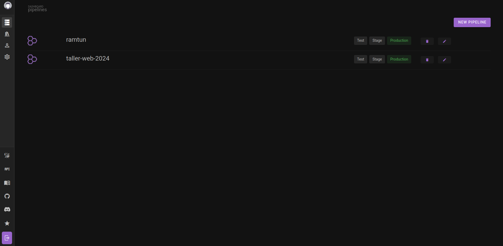
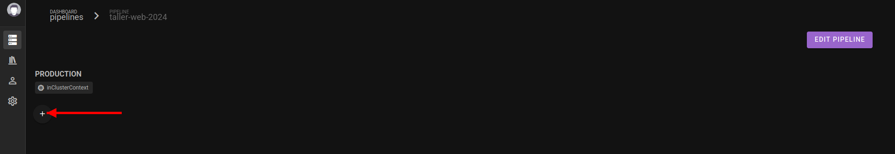
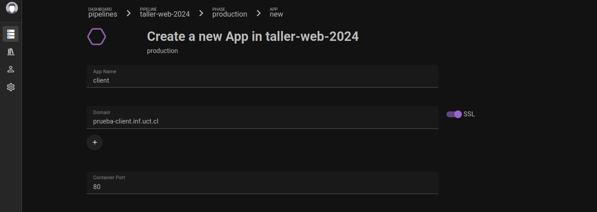
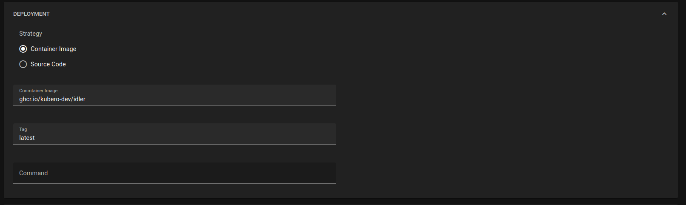
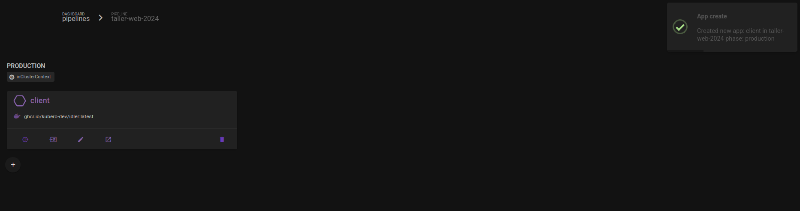
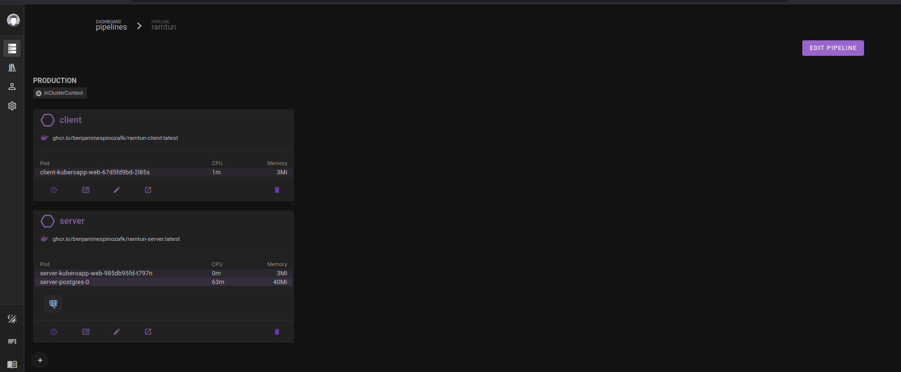

# Crear Pipeline y App

## Crear un Pipeline

Un **Pipeline** agrupa todas las apps de tu proyecto bajo un mismo nombre.

### Pasos

1. En el dashboard de Kubero, haz clic en el botón **"New Pipeline"**



2. Completa el formulario:

   | Campo | Qué ingresar |
   |---|---|
   | **Name** | Nombre de tu proyecto, sin espacios (ej: `taller-web-2024`) |
   | **Phases** | Selecciona `production` |

3. Haz clic en **"Create Pipeline"**



4. El pipeline aparece en el dashboard. Haz clic en él para entrar.



---

## Crear una App y hacer tu primer despliegue

### Paso 1 — Agregar una App al Pipeline

Dentro de tu pipeline, haz clic en **"Add App"** en la fase `production`.



### Paso 2 — Configurar la App

**Sección superior (información básica):**

| Campo | Descripción | Ejemplo |
|---|---|---|
| **App Name** | Nombre del servicio. Solo letras minúsculas y guiones. | `frontend` o `backend` |
| **Domain** | Subdominio donde estará accesible tu app | `mi-app.inf.uct.cl` |
| **Container Port** | Puerto donde escucha tu app dentro del contenedor | `80` (frontend), `8000` (backend) |

> **Sobre el dominio:** Debe ser único en la plataforma. Si `mi-app.inf.uct.cl` ya está en uso, elige algo diferente como `taller2024.inf.uct.cl`. Cualquier subdominio de `*.inf.uct.cl` es válido.



**Sección DEPLOYMENT:**

Aquí se define cómo Kubero descarga y ejecuta tu app.

1. En el selector de estrategia, elige **"Container Image"**
2. Completa los campos que aparecen:

   | Campo | Valor |
   |---|---|
   | **Container Image** | `ghcr.io/tu-usuario/nombre-imagen` (sin el tag) |
   | **Tag** | `latest` |

> El nombre exacto de la imagen lo encuentras en `https://github.com/TU-USUARIO?tab=packages`. Copia el nombre tal como aparece.



### Paso 3 — Guardar y esperar

1. Haz clic en **"Create App"** o **"Save"**
2. La app aparece en el pipeline con un hexágono gris y sin información de pod (descargando la imagen)
3. En 1-2 minutos aparecerá el nombre del pod junto con valores de **CPU** y **Memory** — eso indica que la app está corriendo correctamente





### Paso 4 — Acceder a tu App

Tu app está disponible en la URL que pusiste en el campo Domain:

```
https://mi-app.inf.uct.cl
```
