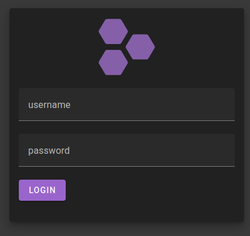
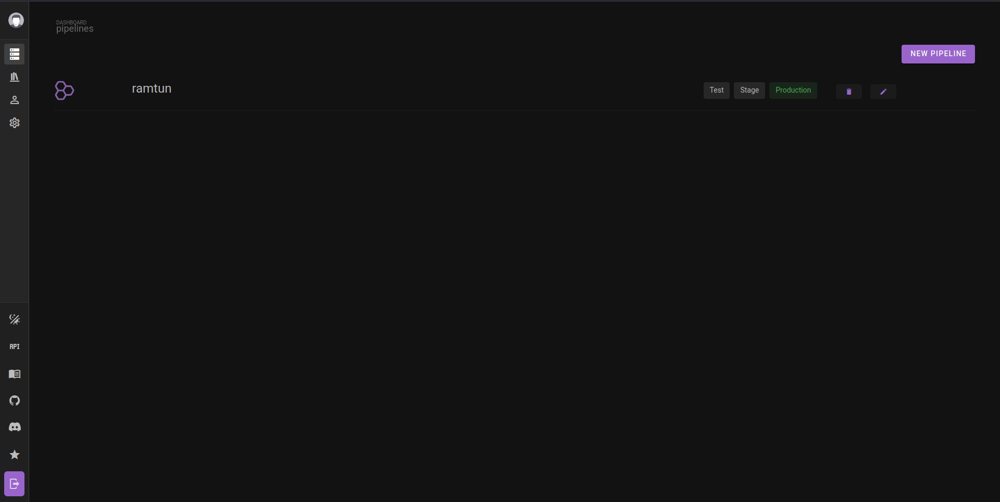
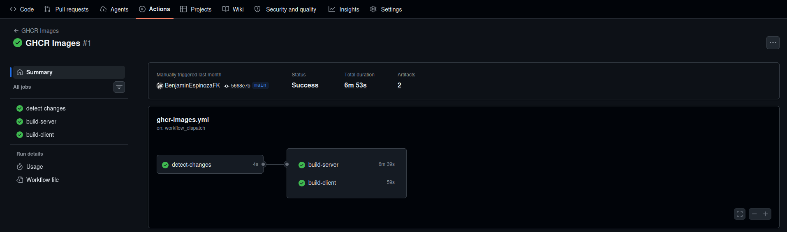
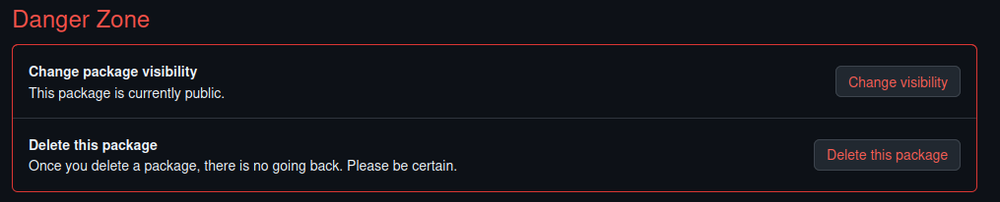

# Primeros Pasos

## Acceder a Kubero

1. Abre tu navegador y ve a **`https://kubero.inf.uct.cl`**
2. Inicia sesión con las credenciales proporcionadas por el profesor.
3. Verás el dashboard principal con todos tus pipelines.





---

## Preparar tu Repositorio en GitHub

Kubero descarga imágenes desde **GitHub Container Registry (ghcr.io)**. Para que funcione, tu repositorio necesita dos cosas:

1. **Un `Dockerfile`** que describa cómo construir la imagen de tu app
2. **Un workflow de GitHub Actions** que construya y suba la imagen a `ghcr.io` automáticamente

### Agregar el workflow de GitHub Actions

Crea el archivo `.github/workflows/docker-build.yml` en tu repositorio con este contenido:

```yaml
name: Docker Build

on:
  push:
    branches: [main]
  workflow_dispatch:

jobs:
  build:
    runs-on: ubuntu-latest
    permissions:
      contents: read
      packages: write

    steps:
      - name: Checkout
        uses: actions/checkout@v4

      - name: Login to GitHub Container Registry
        uses: docker/login-action@v3
        with:
          registry: ghcr.io
          username: ${{ github.actor }}
          password: ${{ secrets.GITHUB_TOKEN }}

      - name: Build and push image
        uses: docker/build-push-action@v5
        with:
          context: .
          push: true
          tags: ghcr.io/${{ github.repository_owner }}/nombre-de-tu-imagen:latest
```

> Cambia `nombre-de-tu-imagen` por el nombre que quieras darle. Si tu proyecto tiene frontend y backend separados, necesitarás un job por cada uno apuntando al Dockerfile correspondiente.

Después de hacer `git push`, GitHub Actions construirá y publicará la imagen automáticamente. Puedes ver el progreso en la pestaña **"Actions"** de tu repositorio.



---

### Último paso — Hacer pública la imagen

Por defecto las imágenes en ghcr.io son privadas. Kubero no puede descargarlas si son privadas.

1. Ve a `https://github.com/TU-USUARIO?tab=packages`
2. Haz clic en el nombre de la imagen
3. Ve a **"Package settings"** (esquina inferior derecha)
4. En la sección "Danger Zone", haz clic en **"Change visibility"** → **"Public"**
5. Repite para cada imagen del proyecto (frontend, backend, etc.)


