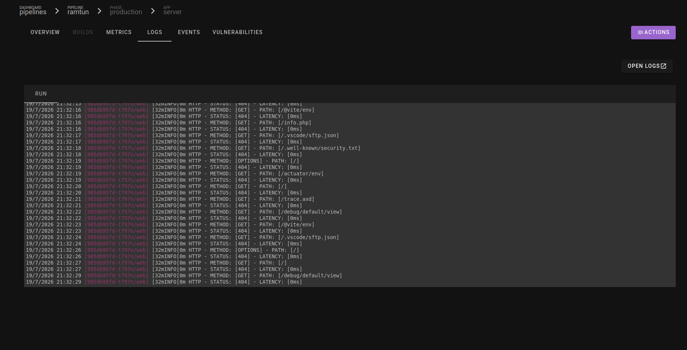

# Routing y Monitoreo

## Routing entre servicios (Frontend + Backend)

En aplicaciones donde el frontend (React, Vue, etc.) y el backend están separados, el frontend necesita saber cómo llegar al backend para hacer llamadas a la API.

### La solución en Kubero UCT: dominios separados

La forma correcta en esta plataforma es darle a cada servicio su **propio dominio** en Kubero. Así el frontend llama directamente al dominio público del backend — sin configuraciones especiales de nginx ni acceso al cluster.

**Ejemplo:**
| App | Dominio en Kubero |
|---|---|
| Frontend | `mi-proyecto.inf.uct.cl` |
| Backend | `api-mi-proyecto.inf.uct.cl` |

El frontend hace sus llamadas API directamente a `https://api-mi-proyecto.inf.uct.cl` desde el código.

### Paso 1 — Crear dos apps en Kubero con dominios distintos

Al crear las apps dentro de tu pipeline, asigna un dominio diferente a cada una:

- App `frontend` → Domain: `mi-proyecto.inf.uct.cl`
- App `backend` → Domain: `api-mi-proyecto.inf.uct.cl`

Ambas apps quedan accesibles con HTTPS automático desde sus respectivos dominios.

### Paso 2 — Configurar la URL del backend en el frontend

En tu código del frontend, usa una variable de entorno para definir la URL base del backend:

```env
VITE_API_URL=https://api-mi-proyecto.inf.uct.cl
```

Agrega esta variable en Kubero dentro de la app `frontend` (sección **ENVIRONMENT VARIABLES**).

En el código del frontend, úsala así (ejemplo con Vite + React):

```javascript
const API_URL = import.meta.env.VITE_API_URL

// Ejemplo de llamada
const response = await fetch(`${API_URL}/users/login`, {
  method: 'POST',
  body: JSON.stringify({ email, password })
})
```

> **¿Por qué no usar nginx como proxy (`/api/`)?**
> Hacer que `/api/` redirija al backend en el mismo dominio requiere modificar el Ingress de Kubernetes, lo cual no se puede hacer desde la UI de Kubero. La solución de dominios separados funciona completamente desde la interfaz sin tocar el cluster.

---

## Monitorear tu Despliegue

### Estado de la App (hexágono en Kubero)

El hexágono de cada app en el pipeline indica su estado:

| Estado | Significado |
|---|---|
| Gris / vacío | La app está iniciando o la imagen se está descargando |
| Verde | La app está corriendo correctamente |
| Rojo / amarillo | Hubo un error. Revisa los logs |

> La vista del pipeline con las apps corriendo se ve igual a la imagen anterior (sección "Verificar que tu App está Corriendo").

### Ver Logs en Tiempo Real

Los logs muestran la salida de tu aplicación y son la principal herramienta para diagnosticar errores.

1. Haz clic en el ícono del reloj ⏱ (o "Logs") en tu app
2. Verás la salida de tu aplicación en tiempo real



### Errores comunes y cómo resolverlos

| Error en logs | Causa | Solución |
|---|---|---|
| `Name does not resolve` | El hostname de la base de datos está mal escrito | Verifica que `POSTGRES_HOST` sea `[tu-app]-postgres` |
| `password authentication failed` | Las credenciales de la DB no coinciden | Revisa que `POSTGRES_USER` y `POSTGRES_PASSWORD` sean los mismos que configuraste en el addon |
| `connection refused` | Puerto equivocado o servicio no está corriendo | Verifica el puerto (postgres: `5432`, no `80`) |
| `ImagePullBackOff` | Kubero no puede descargar la imagen | Verifica que la imagen en ghcr.io sea pública |
| `CrashLoopBackOff` | La app inicia y falla repetidamente | Lee los logs para ver el error específico |

---

## Limitaciones Conocidas

Estas son limitaciones de la configuración actual de Kubero en la UCT que es importante conocer:

| Limitación | Descripción |
|---|---|
| **No hay build interno** | Kubero en la UCT no construye imágenes internamente. Siempre debes usar la estrategia "Container Image" con imágenes ya construidas en GitHub Actions y subidas a ghcr.io |
| **Dominio obligatorio** | Kubero requiere un dominio para todas las apps. Si no quieres exponer un servicio, igual debes ingresar un dominio (pero el servicio no tendrá ingress público si es un addon) |
| **Health checks en PostgreSQL** | Kubero activa health checks HTTP para todas las apps por defecto, lo que falla en servicios que no hablan HTTP (como PostgreSQL). Si el addon de postgres crashea, desactiva los health checks en la sección **HEALTH CHECKS** de la app |
| **Routing multi-servicio** | Si el frontend y el backend comparten el mismo dominio, el nginx del frontend debe estar configurado para hacer `proxy_pass` al servicio interno del backend. Esto debe hacerse en el `nginx.conf` de la imagen del frontend |
